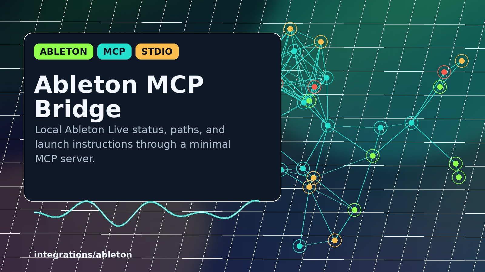

# Ableton MCP Bridge



Minimal MCP server for a local Ableton Live 12 Suite install.

This repo is intentionally narrow. It exposes the local Ableton install path,
status checks, and launch instructions over JSON-RPC/MCP stdio. It does not
control Ableton sets, clips, tracks, devices, or UAD hardware yet.

## Tools

- `ableton_paths`: returns configured Windows, WSL, User Library, Remote Scripts, and OSC paths.
- `ableton_status`: checks whether the configured executable and folders are visible.
- `ableton_launch_instructions`: returns the Windows command for launching Ableton Live.

## Layout

```text
integrations/ableton/ableton_mcp_server.py  # MCP stdio server
integrations/ableton/ableton_config.json    # local Ableton paths
tests/test_ableton_mcp_server.py            # server tests
.github/workflows/tests.yml                 # GitHub Actions test workflow
assets/ableton-mcp/                         # README and social preview images
```

## Run Locally

```bash
python3 integrations/ableton/ableton_mcp_server.py
```

Then send JSON-RPC lines on stdin. Example:

```json
{"jsonrpc":"2.0","id":1,"method":"tools/list","params":{}}
```

## Claude/Codex MCP Config

Use this server entry:

```json
{
  "mcpServers": {
    "ableton-local": {
      "type": "stdio",
      "command": "python3",
      "args": [
        "integrations/ableton/ableton_mcp_server.py"
      ],
      "env": {}
    }
  }
}
```

If your MCP host runs outside the repo root, use the absolute script path.

## Test

```bash
python3 -m pytest
```

## GitHub Upload

Upload the contents of this folder as the repo root. For the GitHub social
preview, use:

```text
assets/ableton-mcp/github-social-preview.png
```

